# Frontend Mentor - Newsletter sign-up form with success message solution

This is a solution to the [Newsletter sign-up form with success message challenge on Frontend Mentor](https://www.frontendmentor.io/challenges/newsletter-signup-form-with-success-message-3FC1AZbNrv). Frontend Mentor challenges help you improve your coding skills by building realistic projects. 

## Table of contents

- src
  - [assets]
      - illustration-sign-up-desktop.svg
  - [components]
      - Card.js
      - SuccessCard.js
  - [scss]
      - main.scss
  - App.js
  - index.css
  - index.js

## Overview

### The challenge

Users should be able to:

- Add their email and submit the form
- See a success message with their email after successfully submitting the form
- See form validation messages if:
  - The field is left empty
  - The email address is not formatted correctly
- View the optimal layout for the interface depending on their device's screen size
- See hover and focus states for all interactive elements on the page

### Screenshot

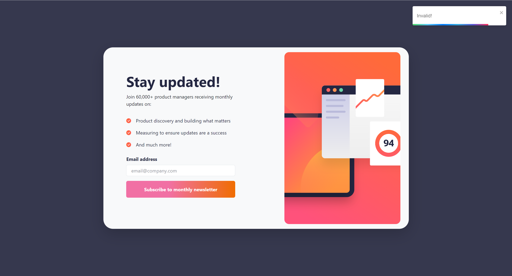
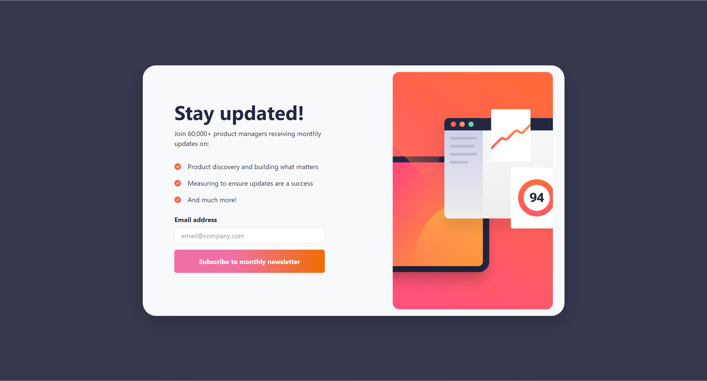
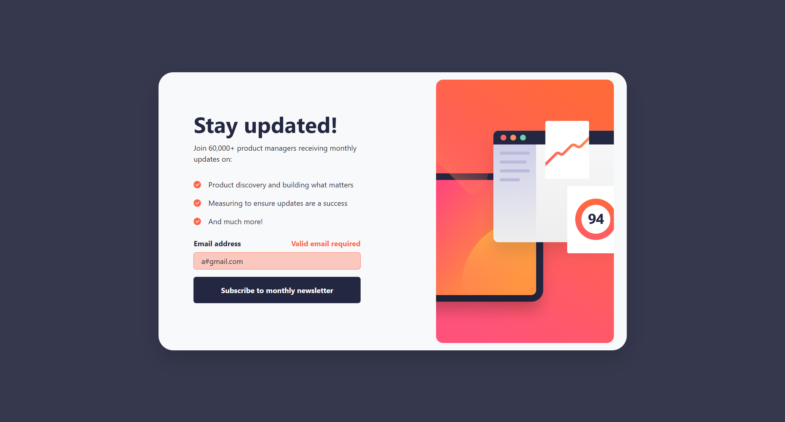
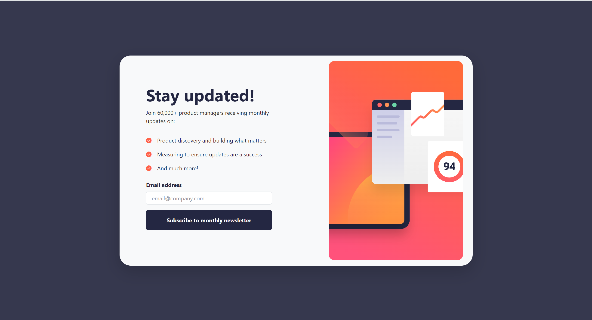
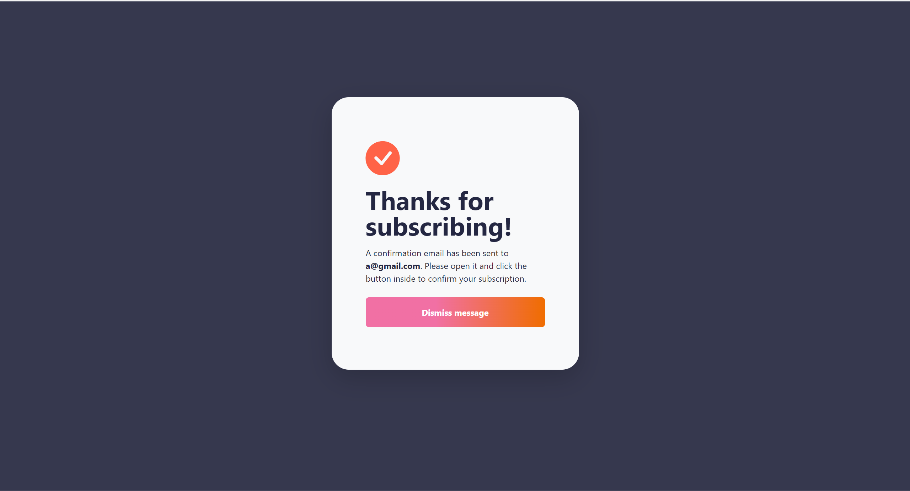
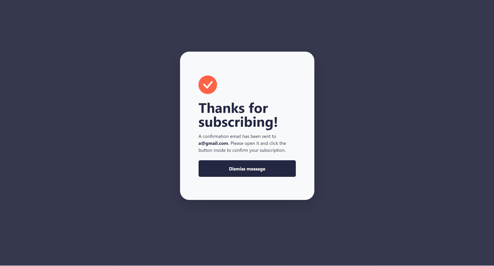
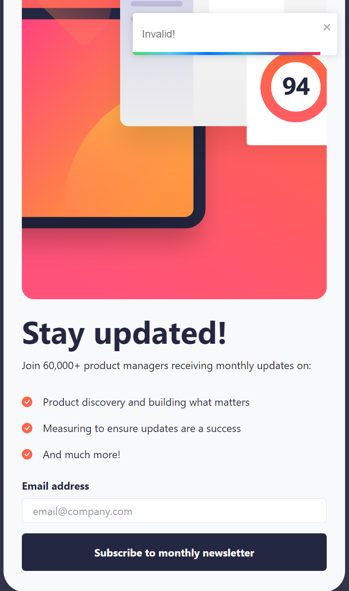
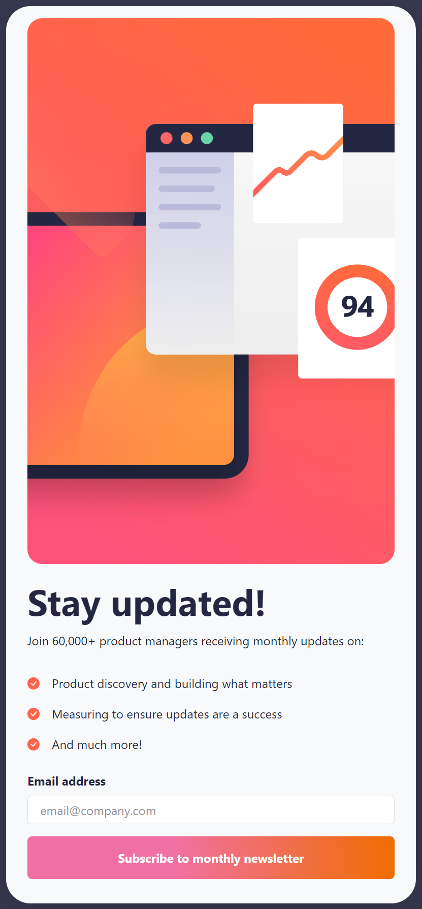
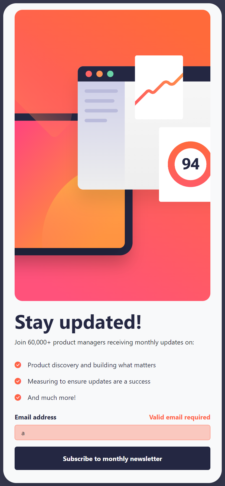
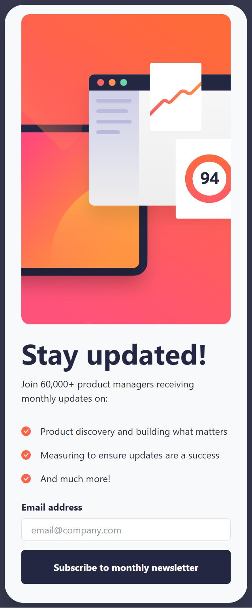
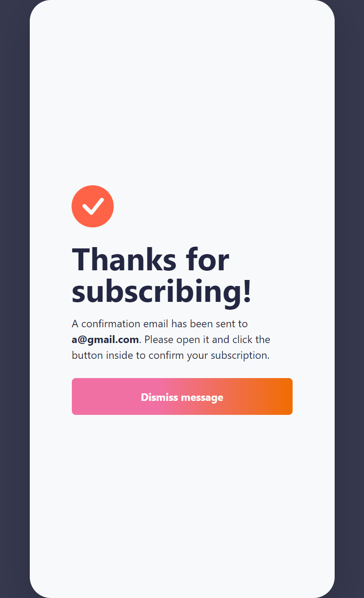
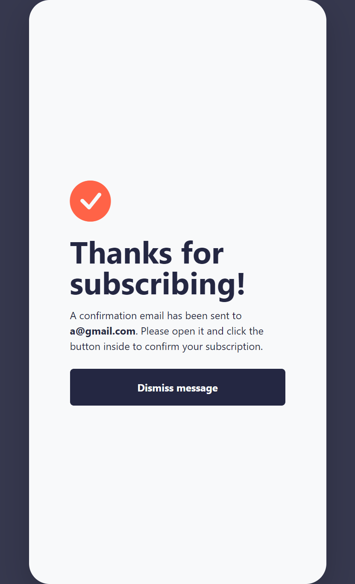

### Links

- Live Site URL: [Newsletter-signup-with-success](https://newsletter-signup-with-success.vercel.app/)

## My process

### Built with

- Semantic HTML5 markup
- Bootstrap 5.3
- CSS custom properties
- Flexbox
- Mobile-first workflow
- [React](https://reactjs.org/) - JS library
- React-Toastify
- SASS

### What I learned

Use this section to recap over some of your major learnings while working through this project. Writing these out and providing code samples of areas you want to highlight is a great way to reinforce your own knowledge.

To see how you can add code snippets, see below:

```html
<input
                  type="email"
                  value={email}
                  onChange={handleChange}
                  className={`form-control custom-input ps-3 ${
                    isValid ? "" : "bg-primarylight border-primary"
                  }`}
                  id="myInput"
                  aria-describedby="emailHelp"
                  placeholder="email@company.com"
                />
```
```css
.custom-input {
  /* Add styles for focused input */
  &:focus {
    border-color: none; 
    box-shadow: none;/* Change to your desired border color */
    outline: none; /* Optional: Remove the default blue outline */
  }
}
```
```js
if(isValid && email !== ''){
        navigate("/success/" + document.getElementById("myInput").value);
}
```

### Continued development

I would like to improve on my css skills and quality code formats.

### Useful resources

- [React-router-dom-V6](https://reactrouter.com/en/main/upgrading/v5#upgrade-all-switch-elements-to-routes) - This helped me for navigating through pages with email input as props.
- [React-toastify](https://fkhadra.github.io/react-toastify/introduction/) - This is an amazing docs which helped me implement toastify for my messages. I'd recommend it to anyone still learning this concept.

## Author

- Website - [Saphal Sherchan](https://saphalsherchan.com.np/)
- Frontend Mentor - [@SherchanStrikes](https://www.frontendmentor.io/profile/SherchanStrikes)

## Acknowledgments

I would like to thank FrontendMentor for testing my strength and weaknesses, i recommend anyone to try this challenge if you are serious in Web Development ! :D
